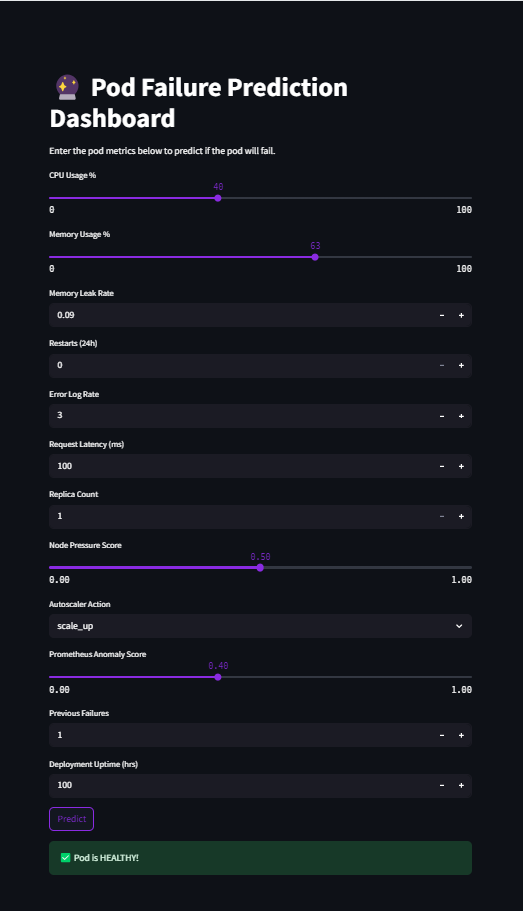

# Pod Failure Prediction System

This project predicts if a Kubernetes pod will fail soon or if it is healthy using Machine Learning.

## How to Run API
uvicorn api.main:app --reload

Open in browser:
http://127.0.0.1:8000/docs

## How to Run Dashboard
streamlit run app/dashboard.py

## Sample Input (JSON)
{
  "cpu_usage_pct": 75,
  "memory_usage_pct": 60,
  "memory_leak_rate": 0.08,
  "restart_count_24h": 1,
  "error_log_rate": 5,
  "request_latency_ms": 120,
  "replica_count": 3,
  "node_pressure_score": 0.50,
  "autoscaler_action": "scale_up",
  "prometheus_anomaly_score": 0.45,
  "previous_failures": 2,
  "deployment_uptime_hrs": 150
}

## Project Files
api/main.py        → FastAPI backend  
app/dashboard.py   → Streamlit dashboard  
src/train_model.py → Train model  
src/predict.py     → Test model  
models/best_model.pkl → Saved model  

## Author
Shahul Hussain
